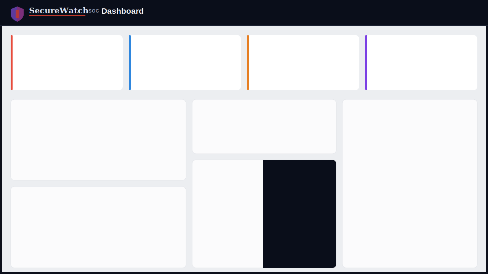
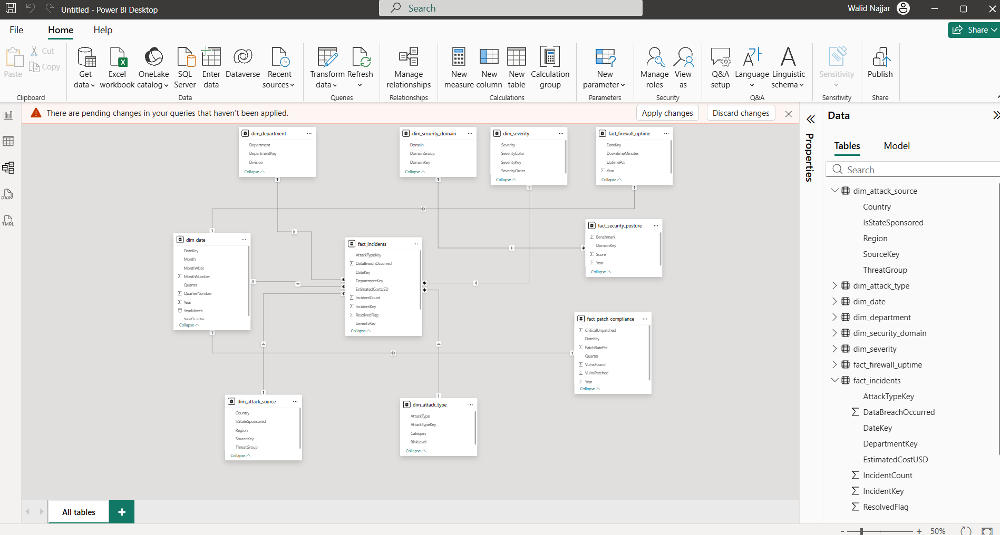
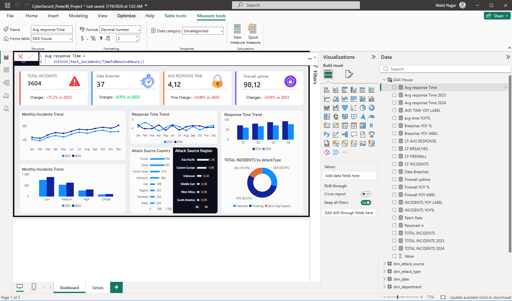
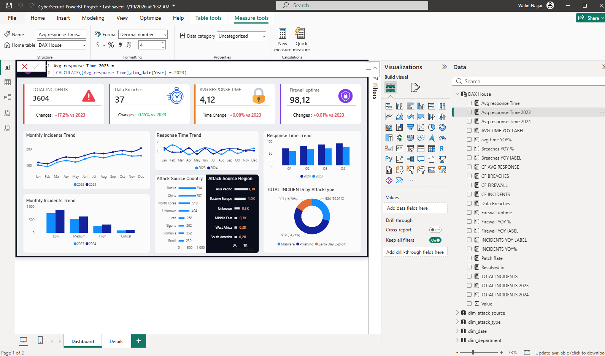
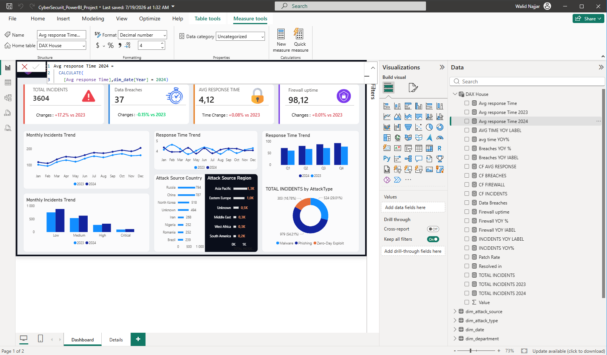
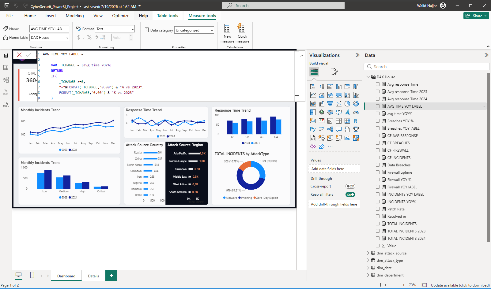
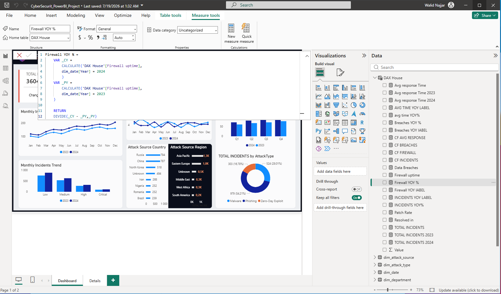
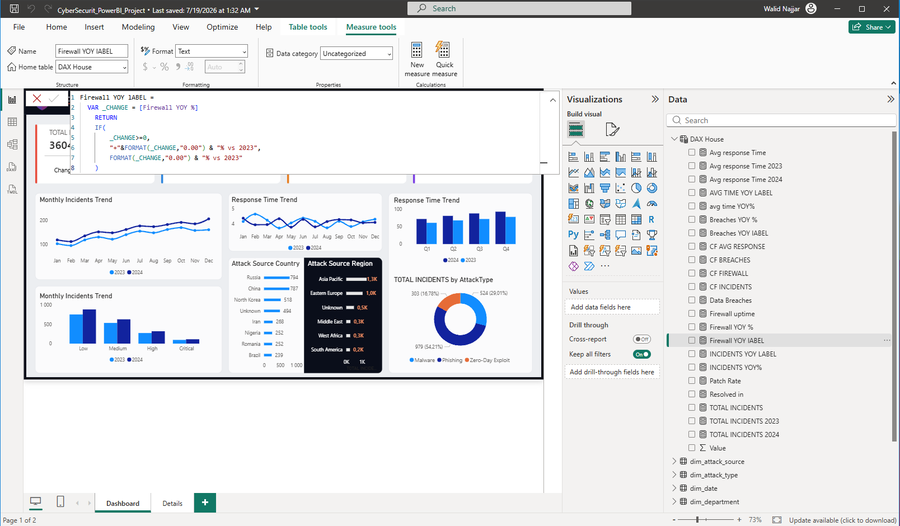
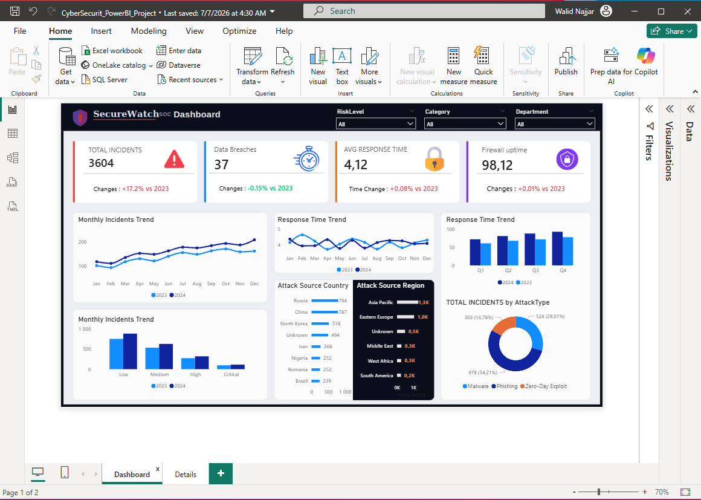
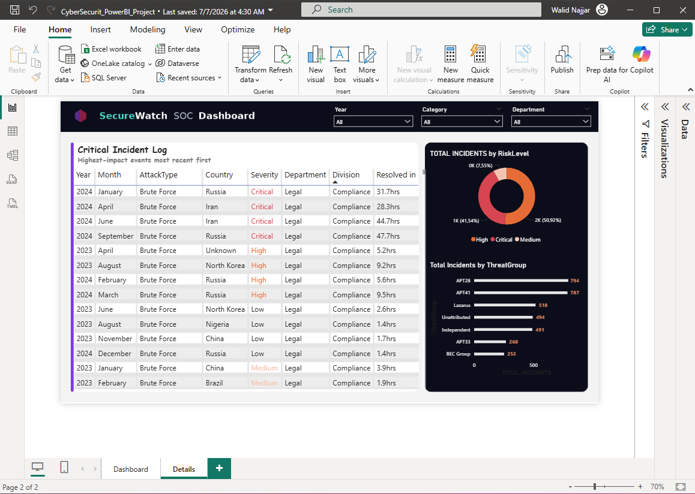

# 🛡️ SecureWatch SOC Dashboard

Tableau de bord Power BI dédié au suivi des performances d'un Security Operations Center (SOC) : incidents de sécurité, fuites de données, temps de réponse, disponibilité du firewall et conformité des correctifs.



---

## 📌 Contexte du projet

Ce projet a pour objectif d'analyser l'activité d'un centre opérationnel de sécurité (SOC) à partir de données d'incidents cyber (2023–2024) afin de :

- Suivre l'évolution du **nombre d'incidents**, des **fuites de données (Data Breaches)** et du **temps de réponse moyen**.
- Mesurer la **disponibilité du firewall** et la progression des correctifs de sécurité (patchs).
- Identifier les **sources d'attaque** (pays, région), les **types d'attaques** (Malware, Phishing, Zero-Day Exploit) et les **groupes de menaces (Threat Groups)** les plus actifs.
- Comparer les indicateurs **année sur année (YoY)** entre 2023 et 2024.

---

## 🗂️ Structure du dépôt

```
├── images/                  # Captures d'écran du dashboard, des mesures DAX et des maquettes
└── CyberSecurite_DataFiles/ # Fichiers Excel sources utilisés pour alimenter le modèle Power BI
```

---

## 🧩 Modèle de données

Le modèle suit une architecture en **étoile (star schema)**, avec des tables de faits et des tables de dimensions reliées entre elles :

**Tables de faits :**
- `fact_incidents` — détail de chaque incident (type d'attaque, sévérité, coût estimé, statut résolu, temps de résolution…)
- `fact_firewall_uptime` — disponibilité mensuelle du firewall
- `fact_patch_compliance` — taux de correctifs appliqués / vulnérabilités trouvées
- `fact_security_posture` — score de posture de sécurité par domaine

**Tables de dimensions :**
- `dim_date` (année, mois, trimestre…)
- `dim_attack_source` (pays, région, groupe de menace, sponsor étatique…)
- `dim_attack_type` (catégorie, niveau de risque)
- `dim_department` (département, division)
- `dim_security_domain`
- `dim_severity`



---

## 📐 Construction des mesures DAX

Voici la démarche suivie pour construire les indicateurs clés du dashboard, mesure par mesure.

### 1. Temps de réponse moyen (base)
```dax
Avg response Time = AVERAGE(fact_incidents[TimeToResolveHours])
```
Mesure de base calculant la moyenne du temps de résolution des incidents (en heures), tous incidents confondus.



### 2. Temps de réponse moyen — 2023
```dax
Avg response Time 2023 = CALCULATE([Avg response Time], dim_date[Year] = 2023)
```
Filtre la mesure précédente sur l'année 2023 grâce à `CALCULATE`.



### 3. Temps de réponse moyen — 2024
```dax
Avg response Time 2024 = CALCULATE([Avg response Time], dim_date[Year] = 2024)
```
Même logique, appliquée à l'année 2024.



### 4. Évolution du temps de réponse (YoY %)
```dax
avg time YOY% =
VAR _TCY = [Avg response Time 2024]
VAR _TPY = [Avg response Time 2023]
RETURN DIVIDE(_TCY - _TPY, _TPY) * 100
```
Calcule la variation en pourcentage du temps de réponse entre 2023 et 2024, en utilisant des variables (`VAR`) pour plus de lisibilité et `DIVIDE` pour éviter les erreurs de division par zéro.


### 5. Label dynamique de l'évolution du temps de réponse
```dax
AVG TIME YOY LABEL =
VAR _TCHANGE = [avg time YOY%]
RETURN
IF(
    _TCHANGE >= 0,
    "+" & FORMAT(_TCHANGE, "0.00") & "% vs 2023",
    FORMAT(_TCHANGE, "0.00") & "% vs 2023"
)
```
Transforme le pourcentage en texte formaté et lisible pour l'affichage dans les cartes KPI (ajout d'un signe `+` si la valeur est positive).



### 6. Évolution des fuites de données (YoY %)
```dax
Breaches YOY % =
VAR _CY = CALCULATE('DAX House'[Data Breaches], dim_date[Year] = 2024)
VAR _PY = CALCULATE('DAX House'[Data Breaches], dim_date[Year] = 2023)
RETURN DIVIDE(_CY - _PY, _PY)
```
Même logique de comparaison année sur année, appliquée cette fois au nombre de fuites de données (`Data Breaches`).


### 7. Évolution de la disponibilité du firewall (YoY %)
```dax
Firewall YOY % =
VAR _CY = CALCULATE('DAX House'[Firewall uptime], dim_date[Year] = 2024)
VAR _PY = CALCULATE('DAX House'[Firewall uptime], dim_date[Year] = 2023)
RETURN DIVIDE(_CY - _PY, _PY)
```



### 8. Label dynamique de l'évolution du firewall
```dax
Firewall YOY LABEL =
VAR _CHANGE = [Firewall YOY %]
RETURN
IF(
    _CHANGE >= 0,
    "+" & FORMAT(_CHANGE, "0.00") & "% vs 2023",
    FORMAT(_CHANGE, "0.00") & "% vs 2023"
)
```



---

### Autres mesures du modèle (mêmes patterns, sans capture dédiée)

Le reste des mesures suit exactement les mêmes principes de construction (mesure de base → déclinaison par année → calcul YoY % → label texte), appliqués aux autres KPIs du dashboard :

- **`TOTAL INCIDENTS`**, **`TOTAL INCIDENTS 2023`**, **`TOTAL INCIDENTS 2024`** — comptage du nombre total d'incidents (`COUNT`/`COUNTROWS` sur `fact_incidents`), décliné par année via `CALCULATE`.
- **`INCIDENTS YOY%`** et **`INCIDENTS YOY LABEL`** — évolution en pourcentage du nombre d'incidents entre 2023 et 2024, avec label formaté.
- **`Breaches YOY LABEL`** — équivalent textuel de `Breaches YOY %` (mêmes logique `IF`/`FORMAT` que pour le temps de réponse et le firewall).
- **`Patch Rate`** — taux de correctifs appliqués, calculé à partir de `fact_patch_compliance` (rapport entre vulnérabilités corrigées et vulnérabilités trouvées).
- **`Resolved in`** — mesure liée au temps de résolution utilisée dans le tableau détaillé des incidents critiques (`Critical Incident Log`).
- **`CF AVG RESPONSE`, `CF BREACHES`, `CF FIREWALL`, `CF INCIDENTS`** — mesures de type "Column Format" utilisées pour piloter dynamiquement la couleur conditionnelle des cartes KPI (rouge/vert selon que la tendance est positive ou négative), en s'appuyant sur les mesures YoY % correspondantes.

---

## 📊 Aperçu du dashboard

**Page 1 — Vue d'ensemble**



La première page regroupe :
- 4 cartes KPI : Total Incidents (3 604), Data Breaches (37), Avg Response Time (4,12h), Firewall Uptime (98,12%), chacune avec son évolution YoY.
- Une courbe d'évolution mensuelle des incidents (2023 vs 2024).
- Un histogramme des incidents par niveau de sévérité (Low, Medium, High, Critical).
- Un classement des pays et régions sources d'attaques (Russie, Chine, Corée du Nord en tête ; Asie-Pacifique et Europe de l'Est en tête des régions).
- Un donut chart de la répartition des incidents par type d'attaque (Malware, Phishing, Zero-Day Exploit).

**Page 2 — Détails et journal des incidents critiques**



La seconde page présente :
- Un **journal des incidents critiques** (Critical Incident Log), trié du plus récent au plus impactant, avec département, division et temps de résolution.
- La répartition des incidents par **niveau de risque** (High, Critical, Medium).
- Le classement des **groupes de menaces (Threat Groups)** les plus actifs : APT28, APT41, Lazarus, groupes non attribués, APT33, BEC Group.

---

## 🔍 Analyse et principaux constats

- **Hausse du volume d'incidents** : +17,2 % d'incidents en 2024 par rapport à 2023, ce qui traduit une intensification globale de l'activité malveillante.
- **Fuites de données quasi stables** : légère baisse de -0,15 % des Data Breaches, signe que malgré la hausse des incidents, les fuites effectives restent maîtrisées.
- **Temps de réponse stable** : évolution marginale de +0,08 % du temps de réponse moyen (4,12h), ce qui indique une capacité de réponse du SOC qui suit le rythme de la hausse des incidents.
- **Firewall performant** : disponibilité de 98,12 % (+0,01 % vs 2023), un niveau élevé et stable.
- **Concentration géographique des menaces** : la Russie, la Chine et la Corée du Nord sont les principales sources d'attaques identifiées, avec l'Asie-Pacifique comme région la plus exposée.
- **Répartition des attaques** : le Phishing et le Malware dominent largement (près de 46 % à eux deux), suivis du Zero-Day Exploit.
- **Groupes de menaces actifs** : APT28 et APT41 concentrent le plus grand nombre d'incidents détectés, suivis de Lazarus.
- **Sévérité des incidents** : une part significative des incidents reste classée en sévérité "High"/"Critical", justifiant le suivi rapproché via le journal des incidents critiques (page 2).

---

## 🛠️ Technologies utilisées

- **Power BI Desktop** — modélisation, DAX, visualisation
- **DAX** (Data Analysis Expressions) — mesures calculées (moyennes, comparaisons YoY, labels dynamiques)
- **Excel** — fichiers sources bruts (`CyberSecurite_DataFiles/`)
- **Python (Pillow)** — génération programmatique des visuels d'arrière-plan du dashboard (SVG/PNG)

---

## 👤 Auteur

**Walid Najjar**
[GitHub](https://github.com/WalidDataLab) · [LinkedIn](https://www.linkedin.com/in/walidnajjarr)
